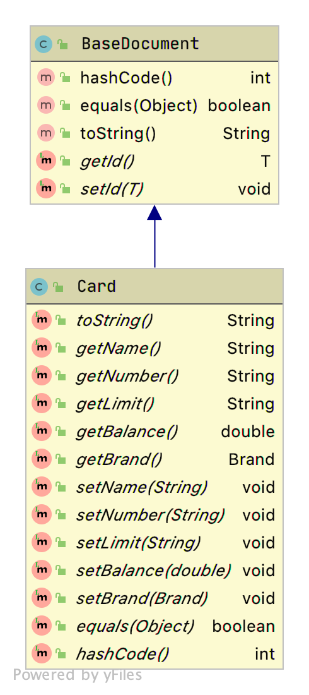
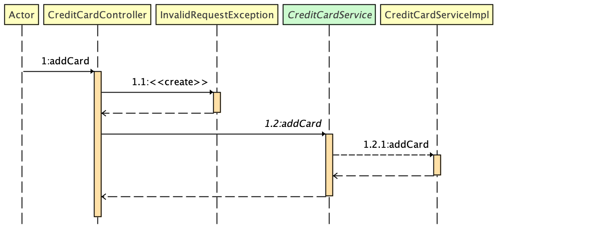
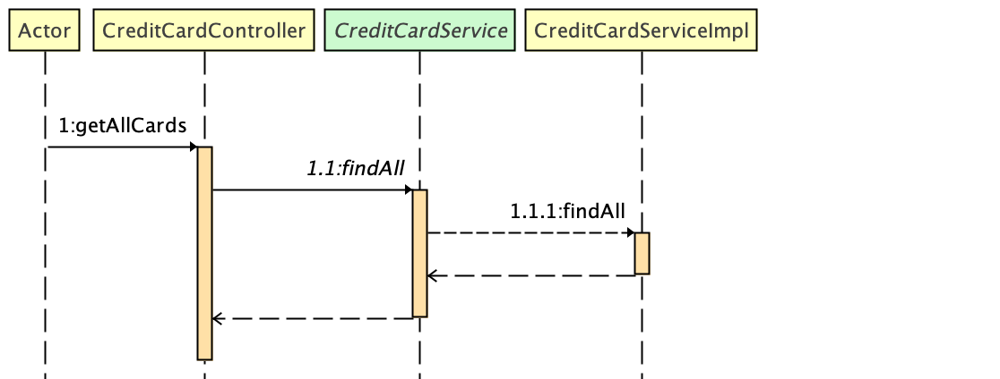

# Credit Card Processing API
Credit card processing system allows adding new credit card to account and fetch existing credit cards by accessing Restful API's.

The credit card processing system has been built upon Spring Boot with support of Embedded MongoDB, 
Spring REST Docs and AsciiDoctor to provide quick access on resources.

This application provides below endpoints
```    
[POST] /api/v1/cards   : Add new credit card
[GET] /api/v1/cards  : Fetch existing cards
```
Full details for above endpoints are documented found [here](https://github.com/rahulmzn/credit-card-processing/tree/master/docs)

### API Validates
* API will except JSON formatted request only.
* Credit card number will be checked based on Luhn10 algorithm
* Card number will be validated for number

Here we have used both type of validation 
* Basic validation provided by libraries like NotNull etc. ( To prove less code apply more standard)
* Hand coded Implementation for card validation (Like Validation of card numbers are done by hand coded Luh10 Algorithm, Implementation of Luhn10 can be found [here](https://github.com/rahulmzn/credit-card-processing/tree/master/src/main/java/com/bank/credit/card/api/constraints))

 > **_NOTE:_** Credit card number will be validated by our Luhn10 implementation which will be handle by our own created custom validation annotation applied on card->number field .

### API Documents
Credit card processing application provides below types of documentation 	
* Automatically generated API documentation (To see follow credit-card-processing/target/generated-docs directory)
* Swagger Open API specification

**For more details refer how to test section below**
    
### API Document Sample	
See [credit-card-processing.pdf](https://github.com/rahulmzn/credit-card-processing/blob/master/docs/credit-card-processing.pdf) 

### Api Class Diagram
class diagrams can be accessed from class-diagram folder [here](https://github.com/rahulmzn/credit-card-processing/tree/master/class-diagram) 

### Model Class Diagram


### Api Sequence Diagram - Add Card


### Api Sequence Diagram - Get all cards


### Database Config
```
* Database: cards
* Collections: cards
* url: localhost
* port: 27057
```
### Spring Boot Config
See [application.properties](https://github.com/rahulmzn/credit-card-processing/blob/master/src/main/resources/application.properties) 


### Prerequisites
This application can be test based on availability of below tools on system.	 

#### Essential
    Java version 8 or later
    Maven version 3 or later 
   
#### Optional
    Development IDE
    REST API Testing Tools (like postman)

### How to Build?

>_NOTE_: To run below commands make maven must be pre configure on system and 

Credit card system use maven build system to compile code 
also maven is used for running all unit-test and integration test to validate application.
	

#### Build and generate API documentation
	mvn clean install 

#### Build Package
	mvn package

### How to Test?
Application can we tested after running above build step.

#### Run application as Standalone Restful API
    mvn package
    mvn spring-boot:run
#### Run application as full-stack package
Find generated application packaged jar file inside credit-card-processing/target/credit-card-processing-0.0.1-SNAPSHOT.jar	
   
    java -jar credit-card-processing-0.0.1-SNAPSHOT.jar

### How access?	
Application will be by default published on port 8080 at localhost, This also can be customised by changing port value for server.port property [application.properties](https://github.com/rahulmzn/credit-card-processing/blob/master/src/main/resources/application.properties)

#### Test Restful API via swagger
After deployment of application [Test Restful API](http://localhost:8080/swagger-ui-custom.html) link can be followed to test API's. 

    Access Test API : http://localhost:8080/swagger-ui-custom.html

>_NOTE:_ Published by default on environment: http://localhost:8080/

### Test Reports
All the reports will be generated under `credit-card-processing/target` after running maven scripts as given above
